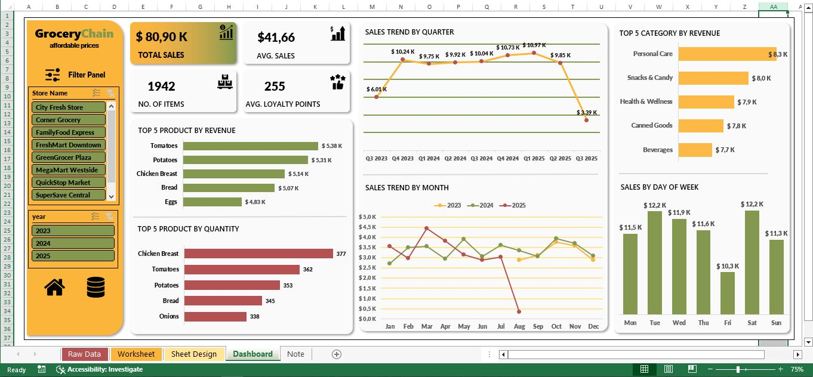

# grocery-chain-excel-dashboard
An Excel dashboard project analyzing grocery chain sales data. Includes revenue trends, top products, sales by category, and customer insights.

# Grocery Chain Excel Dashboard

📊 This project is an **Excel Dashboard** for analyzing grocery chain sales data.  
The dashboard provides insights into:

- ✅ Total Sales & Average Sales
- ✅ Top 5 Products by Revenue & Quantity
- ✅ Sales Trend by Quarter & Month
- ✅ Top 5 Categories by Revenue
- ✅ Sales Distribution by Day of Week

## 📷 Dashboard Preview

## 🔧 Tools Used
- Microsoft Excel (2019)
- Pivot Tables
- Charts & Conditional Formatting
- Slicers for Interactive Filters

## 📂 Project Structure
- `Raw Data` → Contains sales transaction data
- `Worksheet` → Processed and cleaned data
- `Sheet Design` → Chart preparation
- `Dashboard` → Final visualization

## 🎯 Purpose
This project demonstrates how Excel can be used to create professional dashboards for business decision-making and data-driven insights.

